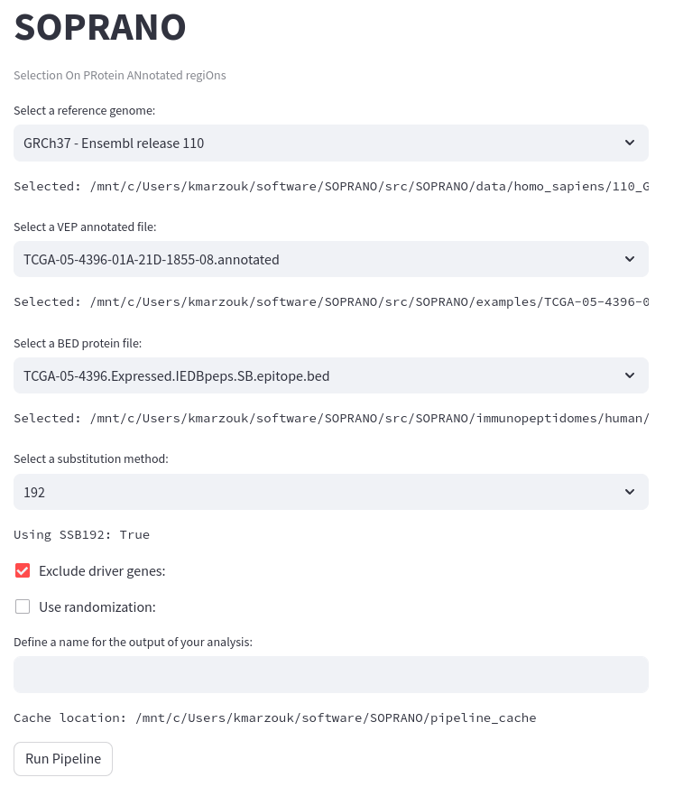

# Graphical application 

SOPRANO can be run from your local browser via a streamlit app, simply run

```{shell}
soprano-app
```


### Running the SOPRANO pipeline

The App interface searches for genome reference files, annotated input files,
and BED protein files readily available on the users system, and presents
them as drop down selections to the user. 

It is straightforward to specify the run time configuration of SOPRANO 
(e.g., to exclude driver genes) with tick boxes. Once a configuration is 
selected, users can execute the SOPRANO pipeline via the **Run Pipeline** 
button.

The processes deployed via the app are identical to those implemented
via the [CLI](CLI.md) - the pipeline steps are equivalent.


### Pipeline data cache

By default, the application will cache pipeline data into the folder relative 
to the SOPRANO repository root named `./pipeline_cache`.

This selection can be overriden by setting the environment variable 
`SOPRANO_CACHE` prior to launching the app. For example,

```shell
export SOPRANO_CACHE=/path/to/my/soprano/cache
soprano-app
```

### Development status

This app is actively being developed (September 2023). The configuration is 
subject to change, and additional features are soon to be integrated.

_Planned features:_

- Generalization of species. Currently only homo sapiens are supported.
- Selection of randomization regions. Currently only available via CLI.
- Selection of transcript files. Currently only available via CLI.
- Interface for linking VEP cache files.
- Interface for downloading genome references.

### Example app

